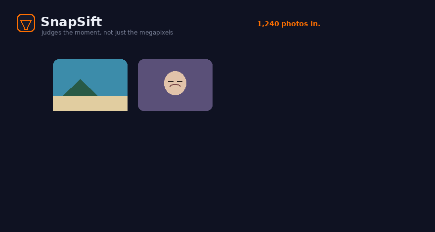

<div align="center">


# SnapSift

### Sift the keepers from the chaos. An AI photo culler that judges the moment, not just the megapixels.

[](LICENSE)
[](https://www.anthropic.com)
[](https://www.python.org)
[](https://developers.google.com/mediapipe)
[](#contributing)


</div>

<p align="center"></p>

SnapSift turns a chaotic dump of trip and event photos into a clean, high-quality keeper set, plus a curated shareable shortlist, without ever deleting an original. It is a Claude skill (works in Claude Cowork and Claude Code) backed by a small, dependency-light Python pipeline that runs entirely on your machine.

It exists because the obvious approach quietly throws away your best shots. Global sharpness rates a crisp background over a soft face. "Keep one per burst" deletes the frame where everyone is actually smiling. SnapSift was built and tuned against thousands of real photos and a photographer's own keep/delete decisions, so it judges the things a human cares about: is the subject sharp, are eyes open, is the person looking ready, is this a moment worth keeping more than one of.

> Your originals are never deleted. Rejects move to an `Archive/` folder with a manifest, and you pull back anything you disagree with.

## Why it is different

- **Subject-aware focus.** It measures sharpness on the face and body, not the whole frame, so an out-of-focus subject in front of a tack-sharp background is correctly rejected.
- **The unready-moment detector.** Using MediaPipe face mesh (478 landmarks, including the iris), it flags blinks (eye-aspect-ratio), looking-away (iris gaze), and turned-away heads (pose) — for every face in a group, not just the biggest one.
- **Full-body person detection.** MediaPipe Pose finds people the face detectors miss (at distance, from behind, at an angle), so people shots are never culled as "scenery."
- **Gentle, moment-aware dedup.** It keeps the best one to three frames of moments you care about and only drops clearly inferior repeats.
- **It learns from you.** Feed it your manual deletions and restorations and it tells you what its scoring still gets wrong, then tunes itself.

## Benchmark

With-skill vs a capable no-skill baseline on a labeled fixture of 26 real DSLR photos (11 good, 15 known-bad including 4 blink/look-away shots). Plan-only, graded against ground truth:

| Configuration | Bad caught | Unready caught | Good wrongly archived | Precision |
|---|---|---|---|---|
| **SnapSift** | **13/15 (86%)** | **3/4** | **0/11** | **100%** |
| No-skill baseline | 9/15 (60%) | 1/4 | 1/11 | 90% |

SnapSift catches more bad shots, catches the unready moments a naive culler misses, and never archives a good photo. Details in [BENCHMARK.md](BENCHMARK.md).

## How it works

```
inventory -> quality metrics -> modern vision -> cluster + score -> verify -> archive -> shortlist -> learn
```

1. **Inventory** the folder (EXIF timeline, video metadata, per-day map).
2. **Quality metrics**: Laplacian + Tenengrad sharpness, well-exposedness and clipping, contrast, colourfulness, saliency-based composition, and a perceptual hash.
3. **Modern vision**: MediaPipe pose + face + per-face readiness (blink, gaze, head pose, smile, face-region sharpness).
4. **Cluster, score, plan**: dedup near-duplicates, pick the best frame by an expression-aware score, reject genuinely poor and unready shots, protect real moments.
5. **Verify** with contact sheets before anything moves.
6. **Archive** rejects (reversible, manifested) and reconcile counts.
7. **Shortlist**: export a balanced, date-ordered, resized set for sharing.
8. **Learn** from your edits.

See [architecture](assets/architecture.svg) and the full method in [snapsift/references/methodology.md](snapsift/references/methodology.md).

## Install

**As a Claude skill (recommended).** Download `snapsift.skill` from the [latest release](../../releases) and install it in Claude Cowork (Settings, Capabilities, Skills) or drop the `snapsift/` folder into your Claude Code skills directory. Then just say: *"my Photos folder is a mess, sift it."*

**As a standalone pipeline.**

```bash
git clone https://github.com/TrueGrit16/snapsift.git
cd snapsift
pip install --break-system-packages -r requirements.txt   # numpy, opencv-python, pillow, "mediapipe==0.10.14"

# point it at a folder of photos
python snapsift/scripts/inventory.py /path/to/photos
python snapsift/scripts/quality_metrics.py /path/to/photos 38   # re-run until ALL DONE
python snapsift/scripts/modern_vision.py  /path/to/photos 36    # re-run until ALL DONE
python snapsift/scripts/build_cull_plan.py /path/to/photos --level balanced
python snapsift/scripts/contact_sheet.py  /path/to/photos --set archive --out ./sheets   # look first
python snapsift/scripts/apply_archive.py  /path/to/photos        # moves rejects to Archive/, reversible
python snapsift/scripts/shortlist_export.py /path/to/photos --count 90 --out Best90
```

Levels: `light`, `balanced` (default), `strong`.

## Privacy

Everything runs locally. No images are uploaded anywhere. SnapSift never deletes your originals; it only moves rejects into a reversible `Archive/` folder with a full manifest.

## Roadmap

- Persona clustering (group a shoot by who is in each photo) via a face-recognition embedding model.
- Optional trained aesthetic model (NIMA) when running with a GPU.
- A one-command wrapper and a simple local web UI for reviewing the plan.
- Video culling (shaky/dark/accidental-clip detection) beyond the current photo focus.

## Contributing

Issues and PRs welcome. The scoring thresholds live in `snapsift/scripts/lib/scoring.py` and are documented in `references/methodology.md`. If you have a folder where it makes a wrong call, that is the most valuable thing you can share (anonymized): it is exactly how the unready-moment detector was found and fixed.

## License

MIT. See [LICENSE](LICENSE).

---

<div align="center">
If SnapSift saved you an afternoon of culling, consider starring the repo.
</div>
